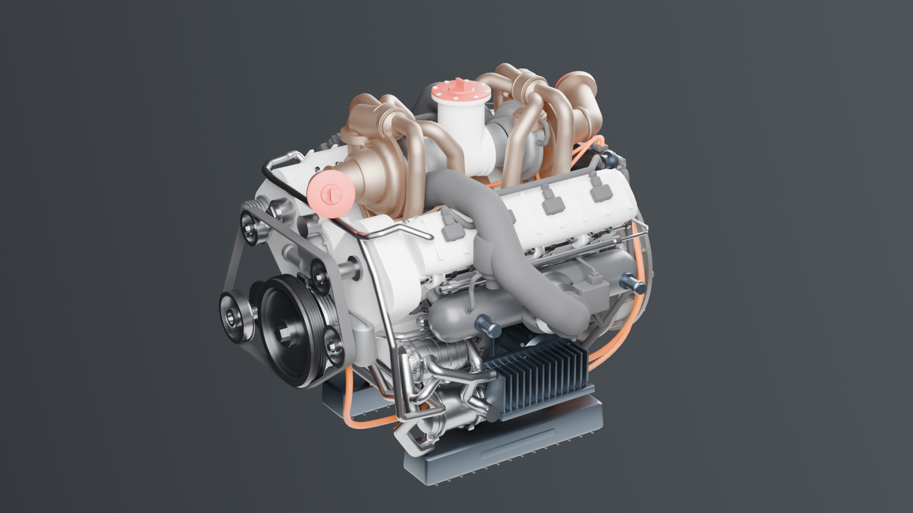

# RX-8V "Vertex" — 2.0 L V8 twin-turbo hybrid

A complete internal-combustion power unit generated procedurally in Blender
from a single specification file. Built to power the
[VX-1 Vortex](https://github.com/krabduke/aero-hypercar), a car whose brief is
to beat Formula 1 cars on a Formula 1 circuit.

**477 parts · 2.0 L · 1,254 hp combined · 16,000 rpm · 146 kg**



## The engine

| | |
|---|---|
| Configuration | 90° V8, flat-plane crank, hot-vee twin turbo, hybrid |
| Displacement | 1,999 cc — 84.0 × 45.1 mm |
| Bore/stroke | 1.86 (oversquare, for revs) |
| Rod/stroke | 1.91 |
| Compression | 14.2:1, direct injection, 3.4 bar boost |
| Redline | 16,000 rpm — 24.1 m/s mean piston speed |
| Firing order | 1-8-3-6-4-5-2-7, even 90° intervals |
| ICE output | 735 kW (986 hp) |
| Hybrid | 200 kW MGU-K + 80 kW MGU-H |
| Combined | 935 kW (1,254 hp) deployable |
| Mass | 146 kg — 6.40 kW/kg |
| Envelope | 738 × 762 × 682 mm, dressed |

**Why a V8 and not something bigger.** F1's power unit is capped near 1000 hp
by regulation, not by physics. Nothing here is regulated, so the constraint is
what steel and titanium survive. Eight cylinders at this bore and stroke reach
16,000 rpm with a mean piston speed of 24.1 m/s — high, but inside what a
racing engine lives at. A flat-plane V8 is also short, stiff and light enough
to be a fully stressed chassis member, which is what lets the car around it be
small.

**Why hot-vee.** The exhaust ports face inward and both turbos sit between the
banks. It is the shortest possible path from port to turbine, which is what
transient response depends on, and it keeps the outside of the engine cold so
the car's bodywork can be tight around it.

**The bottom end is modelled at a real crank angle.** Each piston sits where
its crankpin angle and rod length actually put it — a proper slider-crank
solution at 24° after TDC — rather than with all eight at mid-stroke.

## Build

Requires Blender (`brew install --cask blender`). Nothing else.

```
make build      # generate geometry, assemble build/engine.blend, write parts.csv
make verify     # 38 architecture, kinematic and output checks
make render     # hero, front, cutaway and exploded views
make export     # build/engine.glb
make manifest   # viewer/parts.json
make viewer     # serve the interactive viewer
```

## Verification

`make verify` runs `engine/verify.py`, 40 checks, and then ten audits of the
build: structure, geometry, closed surfaces, interference between parts,
joints, supports, running clearances, the viewer's manifest and scripts, and
the vendored copies. In `engine/verify.py` some checks are dimensional,
measured out of `build/parts.csv`. The interesting ones are design rules:

- **Deck height against the slider-crank.** The deck must sit at throw + rod
  length + compression height, or the piston either never reaches the deck or
  tries to hit the head. The first version of this engine was 50 mm out and the
  check caught it.
- Swept volume, bore/stroke and rod/stroke ratios in usable bands
- Mean piston speed at redline under 26 m/s
- Flat-plane crankpins, and a 90° bank angle — a flat-plane V8 only fires
  evenly at 90°
- Firing order is a genuine permutation of all eight cylinders
- Specific power, power-to-weight, and a credible hybrid share
- Pistons stay inside their bores

## Layout

```
engine/
  spec.py        every dimension, mass and material. No geometry module holds
                 a literal dimension
  mesh.py        pure-Python primitives (shared with the sibling projects)
  parts/
    common.py    bank geometry — placing parts on two bore axes at ±45°
    block.py     block, liners, crankcase, bedplate, sump
    bottomend.py crankshaft, pistons, rods, solved at a real crank angle
    heads.py     heads, camshafts, valves, cam covers, injectors, coils
    induction.py plenum, velocity stacks, throttle
    turbo.py     turbos, hot-vee manifolds, wastegates, tailpipes
    hybrid.py    MGU-K, MGU-H, inverter, battery, ECU
    drive.py     flywheel, clutch, bellhousing, pumps
    plumbing.py  coolant, oil and fuel lines, breathers, pulleys and belt
    ancillaries.py  oil filter and cooler, thermostat, water-to-air charge
                 coolers in the plenums, gear-driven accessories
    harness.py   the wiring loom, routed through the engine by the solver
    detail.py    sensors, fasteners, gallery plugs
  materials.py   PBR: cast aluminium, magnesium, titanium, nitrided steel,
                 carbon, heat-tinted Inconel, copper windings
  assemble.py    the Blender stage
  verify.py      measures the result and checks it against the design rules
  render.py      lighting, cameras, the castings-only cutaway
  export.py      GLB / per-part STL
```

The engine stops where a vehicle takes over, and says where: the main
radiators' stubs -- an outlet each side of the thermostat, and the return
on the tee at the pump's inlet -- and the
charge coolers' low-temperature loop, in and out, on a stub pair on each
plenum's outboard face. The pump and core for that loop are the vehicle's;
the VX-1 carries them in its sidepods.

Everything up to and including `parts/` is pure Python with no `bpy` import, so
the geometry can be generated and tested without Blender.

## Honesty

This is an original design, not a model of any real engine. Every figure is a
design target chosen to be self-consistent, not a measurement. It is a
**geometrically and kinematically coherent model with a credible specification**
— not a validated engine: there is no combustion simulation, no finite-element
work, no thermal or lubrication analysis, and the power figures are targets
rather than results.

## License

MIT — see [LICENSE](LICENSE).
